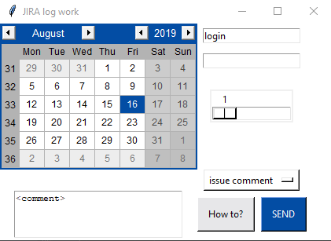

## General info
JIRA worklog tool

## Technologies
Project is created with:
* python3
* jira
* guizero
* tkinter
* tkcalendar

## How to install?
```
pip3 install -r requirements.cfg
```
## Setup
Place 'login'.txt file next to execution file, for example:
```
login.txt
```

Inside this file place your issues and comment (space between is necessary), for example:
```
issue First comment
issue1 Second comment
issue2 Third comment
```

Then run script using python3
```
python3 main.py
```
## Application view

